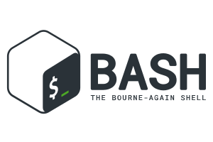
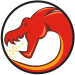
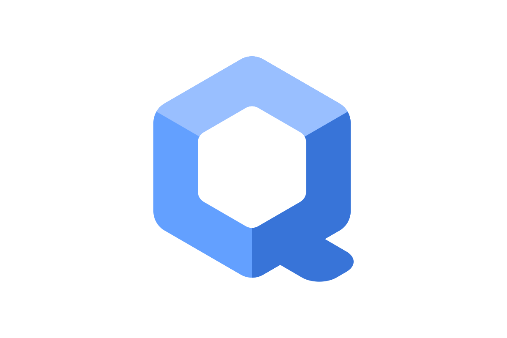

<h1 align="center">

</h1>

Hello, I’m __Mr.N0On3__, a Security Analyst Intern from Bengaluru,India. My passion for technology began at a young age and has only grown stronger as I’ve explored the endless possibilities it offers. As a final-year Computer Science and Engineering student, I’ve focused my academic and professional journey on cybersecurity, with a particular interest in vulnerability assessment and penetration testing.

Throughout my journey, I’ve developed a deep understanding of various security practices, tools, and methodologies. I specialize in identifying and exploiting vulnerabilities using the OWASP framework, which has guided my approach to web application security and network testing. I’m skilled in utilizing the OWASP Top 10 vulnerabilities to assess and strengthen security measures. My experience spans a variety of security techniques, including penetration testing, vulnerability scanning, and risk analysis.
:lock:

- :octocat: I'm an active GitHub user, and you can find some of my featured repositories below.

## :heavy_check_mark: Certifications

- Junior Penetration Tester (eJPTv2) :white_check_mark:
- Web Application Penetration Tester (eWPTv2) :white_check_mark:

## :octocat: Featured Repositories

<table>
  <tr>
    <td></td>
    <td>
      <ul>
        <li><a href="https://github.com/Chittu13/web">WEB Cheatsheet</a> - Web Pentesting Cheatsheet I used during assessments.</li>
        <li><a href="https://github.com/Chittu13/Linux-Privilege-Escalation-Notes">Linux Privilege Escalation Notes</a> - Linux Privilege Escalation notes.</li>
        <li><a href="https://github.com/Chittu13/Windows-Privilege-Escalation-Notes">Windows Privilege Escalation Notes</a> - Windows Privilege Escalation Notes.</li>
        <li><a href="https://github.com/Chittu13/CTF">CTF Cheatsheet</a> - CTF Cheatsheet I used during CTF competitions.</li>
      </ul>
    </td>
  </tr>
</table>

<h2 align="center">💻Tools, languages, and other things that I Learing💻</h2>

<table>
  <tr>
    <td align="left" width="100">
      <b>Programming:</b>
    </td>
        <td align="center" width="96">
      
       C
    </td>
        <td align="center" width="96">
      
       C++
    </td>
        <td align="center" width="96"> 
      
       Java
    </td>
    <td align="center" width="100">
      
       Python
    </td>
    <td align="center" width="96">
      
       Bash
    </td>
      </tr>
  <tr>
    <td align="left" width="100">
      <b>Tools:</b>
    </td>
    <td align="center" width="96">
      
       Nmap
    </td>
        <td align="center" width="96">
      
       Metasploit
    </td>
        <td align="center" width="96">
      
       Wireshark
    </td>
        <td align="center" width="96">
      
       Ghidra
    </td>
        <td align="center" width="96">
      
       BurpSuite
    </td>
  </tr>
    <tr>
    <td align="left" width="100">
      <b>Dev Tools:</b>
    </td>
      <td align="center"  width="96">
      
       Git
    </td>
    <td align="center"  width="96">
      
       GitHub
    </td>
    </tr>
  <tr>
    <td align="left" width="100">
      <b>OS:</b>
    </td>
      <td align="center" width="96">
      
       Linux
    </td>
    <td align="center" width="96">
      
       Tails
    </td>
        <td align="center" width="96">
      
       Qubes
    </td>
    <td align="center" width="96">
      
       RaspberryPi
    </td>
    </tr>
</table>

