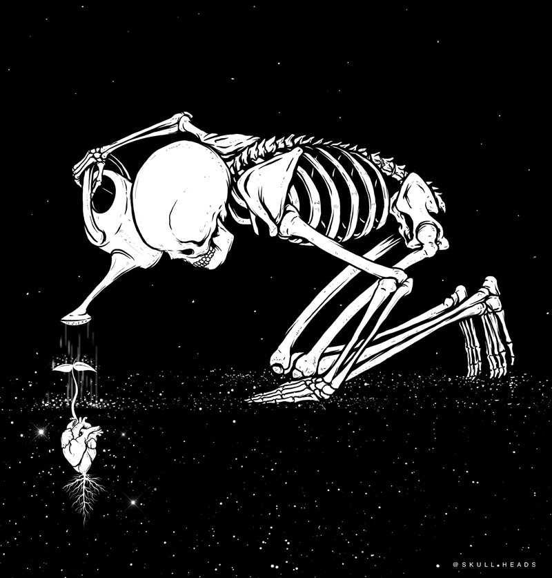

<h1 align="center">

</h1>

  

   

  

- 🌱 I’m currently learning **Networking**

- 💬 Ask me about Linux

- 📫 How to reach me **royalchittu@gmail.com**

- ⚡ Fun fact **I am not Funny**

<h4 align="center">
  <a href="https://github.com/I-Am-Jakoby?tab=repositories" title="Show Repositories">🔎 Show More 🔍</a>
</h4>

 

<h1> MY Status </h1>

This text is red.

   

  

   
     

  

  

  

<h2 align="center">👨‍💻 Favorite Tech 👨‍💻</h2>

<h2 align="center">💻Tools, languages, and other things that I Learing💻</h2>

<table>
  <tr>
    <td align="center" width="100">
      
       Python
    </td>
    <td align="center" width="96">
      
       CMD
    </td>
    <td align="center" width="96">
      
       Bash
    </td>
    <td align="center" width="96">
      
       Kali Linux
    </td>
    <td align="center" width="96">
      
       Visual Studio
    </td>
    <td align="center" width="96">
      
       PowerShell
    </td>
      </tr>
  <tr>
    <td align="center" width="96">
      
       C++
    </td>
    <td align="center" width="96">
      
       HTML5
    </td>
    <td align="center" width="96"> 
      
       CSS3
    </td>
    <td align="center"  width="96">
      
       Git
    </td>
    <td align="center"  width="96">
      
       GitHub
    </td>
    <td align="center" width="96">
      
       MarkDown
    </td>
    
   
  </tr>
</table>

 

<h4 align="center">
  <a href="https://github.com/Chittu13?tab=repositories" title="Show Repositories">🔎 MyRepositories 🔍</a>
</h4>

